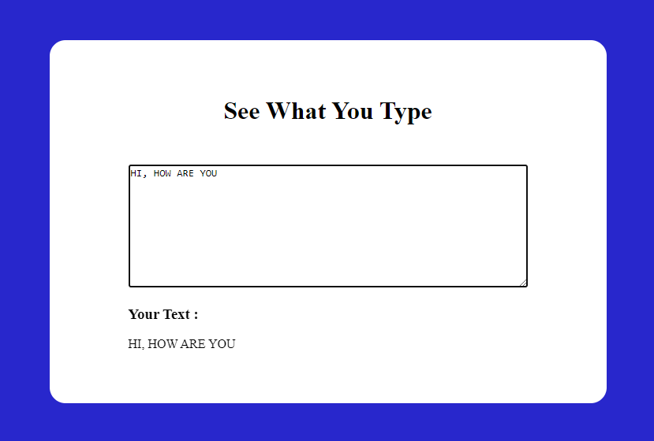

# Project - SEE WHAT YOU TYPE

This is javascript project given in the **Ineuron's Full Stack JavaScript Development Bootcamp**.

 

## 💻 Tech Stack

    - 👉 HTML
    - 👉 CSS
    - 👉 JavaScript

 

## 📌 What I learn?

    - 👉 HTML, CSS and DOM Manipulation
    - 👉 Learned about oninput() method

 

## 📸 Screenshot

 

> Time taken to build this project is 1 hr and I really enjoyed it .

 

##  Acknowledgements:

I am thankful to **Hitesh Choudhary sir**, **Anurag Tiwari sir** and **iNeuron team** for this amazing bootcamp.